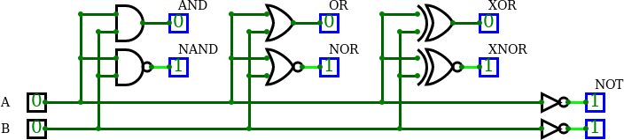

2. 

    

    | **A** | **NOT** |
    | :-: | :-: |
    | 0 | 1 |
    | 1 | 0 |

    | **A** | **B** | **AND** | **NAND** |
    | :-: | :-: | :-: | :-: |
    | 0 | 0 | 0 | 1 |
    | 0 | 1 | 0 | 1 |
    | 1 | 0 | 1 | 0 |
    | 1 | 1 | 1 | 0 |

    | **A** | **B** | **OR** | **NOR** |
    | :-: | :-: | :-: | :-: |
    | 0 | 0 | 0 | 1 |
    | 0 | 1 | 1 | 0 |
    | 1 | 0 | 1 | 0 |
    | 1 | 1 | 1 | 0 |

    | **A** | **B** | **XOR** | **XNOR** |
    | :-: | :-: | :-: | :-: |
    | 0 | 0 | 0 | 1 |
    | 0 | 1 | 1 | 0 |
    | 1 | 0 | 1 | 0 |
    | 1 | 1 | 0 | 1 |


    | **A** | **B** |**C** |  |  |  |
    | :-: | :-: | :-: | :-: | :-: | :-: |
    | 0 | 0 | 0 | 0 | 0 | 0 |
    | 0 | 0 | 1 | 0 | 0 | 0 |
    | 0 | 1 | 0 | 1 | 1 | 1 |
    | 0 | 1 | 1 | 0 | 0 | 0 |
    | 1 | 0 | 0 | 1 | 1 | 1 |
    | 1 | 0 | 1 | 1 | 1 | 1 |
    | 1 | 1 | 0 | 1 | 1 | 1 |
    | 1 | 1 | 1 | 0 | 0 | 0 |


## Synchronize git

1. Use `cd ..` command in Linux terminal and change the working directory to `Digital-electronics-1`. Then use [git commands](https://github.com/joshnh/Git-Commands) to add, commit, and push all local changes to your remote repository. Check the repository at GitHub web page for changes.

    ```bash
    $ pwd
    /home/lab661/Documents/your-name/Digital-electronics-1/Labs/01-gates

    $ cd ..
    $ cd ..
    $ pwd
    /home/lab661/Documents/your-name/Digital-electronics-1

    $ git status
    $ git add <your-modified-files>
    $ git status
    $ git commit -m "[LAB] Adding 01-gates lab"
    $ git status
    $ git push
    $ git status
    ```


## Ideas for other tasks

1. Use online digital circuit simulator, draw the logic diagram according to figure, complete the truth table, and determine the circuit function.

    

    | **A** | **B** | **Q3** | **Q2** | **Q1** | **Q0** |
    | :-: | :-: | :-: | :-: | :-: | :-: |
    | 0 | 0 |  |  |
    | 0 | 1 |  |  |
    | 1 | 0 |  |  |
    | 1 | 1 |  |  |

    > Figure was created in online [draw.io](https://www.draw.io/) diagram editor.
    >

2. Try different online simulators, such as [Logicly](https://logic.ly/), [simulatorIO](https://simulator.io/), [LogicEmu](https://lodev.org/logicemu/), or find others, and compare them.
