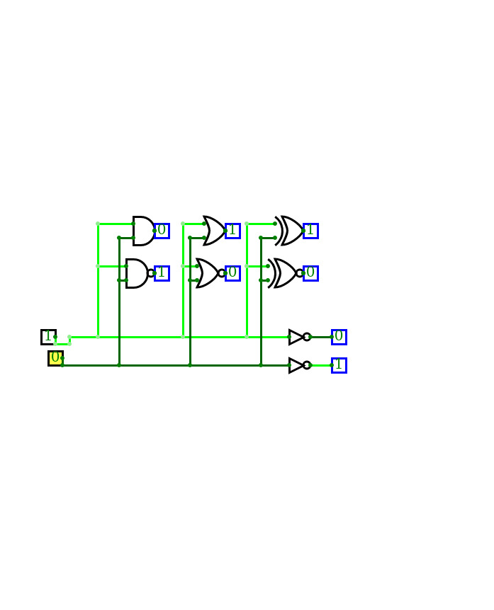

# Lab 1: Git version-control system, Online simulator

#### Table of contents

1. [Lab prerequisites](#Lab-prerequisites)
2. [GitHub](#GitHub)
3. [Linux terminal](#Linux-terminal)
4. [Online simulator](#Online-simulator)
5. [Synchronize git](#Synchronize-git)
6. [Ideas for other tasks](#Ideas-for-other-tasks)

   | **A** | **NOT** |
   | :-: | :-: |
   | 0 | 1 |
   | 1 | 0 |

   | **A** | **B** | **AND** | **NAND** |
   | :-: | :-: | :-: | :-: |
   | 0 | 0 | 0 | 1 |
   | 0 | 1 | 0 | 1 |
   | 1 | 0 | 1 | 0 |
   | 1 | 1 | 1 | 0 |

   | **A** | **B** | **OR** | **NOR** |
   | :-: | :-: | :-: | :-: |
   | 0 | 0 | 0 | 1 |
   | 0 | 1 | 1 | 0 |
   | 1 | 0 | 1 | 0 |
   | 1 | 1 | 1 | 0 |

   | **A** | **B** | **XOR** | **XNOR** |
   | :-: | :-: | :-: | :-: |
   | 0 | 0 | 0 | 1 |
   | 0 | 1 | 1 | 0 |
   | 1 | 0 | 1 | 0 |
   | 1 | 1 | 0 | 1 |

   | **A** | **B** |**C** |  |  |  |
  | :-: | :-: | :-: | :-: | :-: | :-: |
  | 0 | 0 | 0 | 0 | 0 | 0 |
  | 0 | 0 | 1 | 0 | 0 | 0 |
  | 0 | 1 | 0 | 1 | 1 | 1 |   
  | 0 | 1 | 1 | 0 | 0 | 0 |
  | 1 | 0 | 0 | 1 | 1 | 1 |
  | 1 | 0 | 1 | 1 | 1 | 1 |
  | 1 | 1 | 0 | 1 | 1 | 1 |
  | 1 | 1 | 1 | 0 | 0 | 0 |

## Ideas for other tasks

1. Use online digital circuit simulator, draw the logic diagram according to figure, complete the truth table, and determine the circuit function.

    

    | **A** | **B** | **Q3** | **Q2** | **Q1** | **Q0** |
    | :-: | :-: | :-: | :-: | :-: | :-: |
    | 0 | 0 |  |  |
    | 0 | 1 |  |  |
    | 1 | 0 |  |  |
    | 1 | 1 |  |  |

    > Figure was created in online [draw.io](https://www.draw.io/) diagram editor.
    >

2. Try different online simulators, such as [Logicly](https://logic.ly/), [simulatorIO](https://simulator.io/), [LogicEmu](https://lodev.org/logicemu/), or find others, and compare them.

