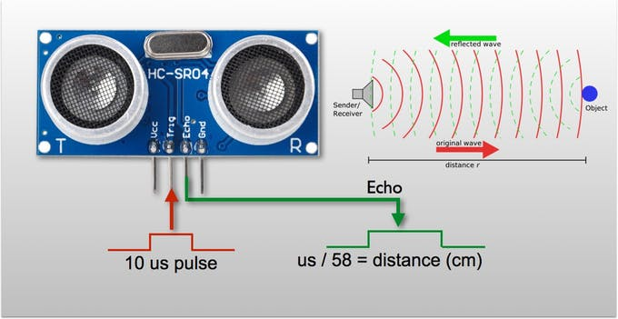
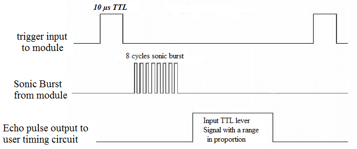
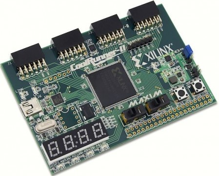
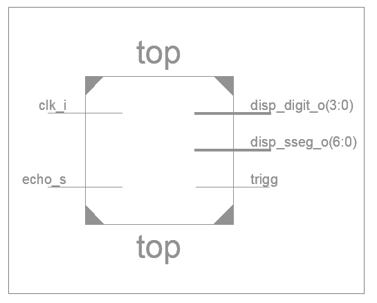
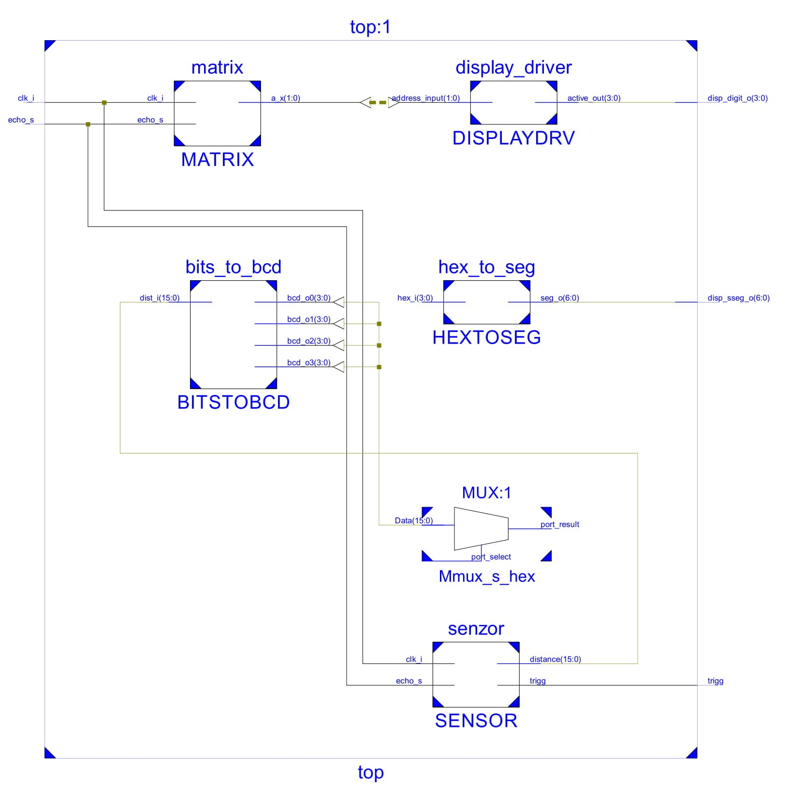
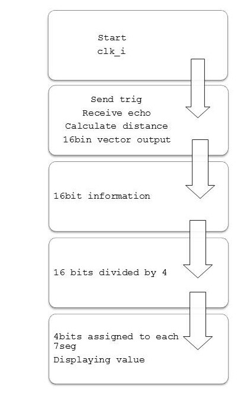
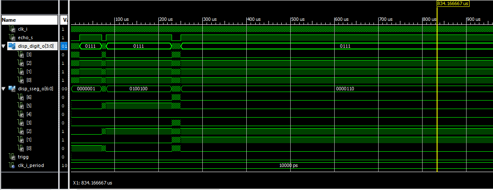

# Project - Measuring distance with HC-SR04 module
#### Digital-electronics-1


## Table of Contents

1. [Introduction](#introduction)
2. [Hardware](#hardware)
3. [Used Software](#software)
4. [Code Tree](#codetree)
5. [Schematic](#schematic)
6. [Function](#function)
7. [Simulations](#simulations)
8. [References](#references)


## Introduction


   In this project we are going to use board *CoolRunner-II CPLD* a sonic range meter module *HC-SR04*.
   The *HC-SR04* will be measuring range from a static object and print it to the seven segment display.


## Hardware

   We will be using:
    ***Ultrasonic Ranging Module HC - SR04***
    

   It provides 2cm - 400cm non-contact measurement function, the ranging accuracy can reach to 3mm. 

   *The basic principle of work: 
    (1) Using IO trigger for at least 10us high level signal,      
    (2) The Module automatically sends eight 40 kHz and detect whether there is a pulse signal back. 
    (3) IF the signal back, through high level , time of high output IO duration is the time
      from sending ultrasonic to returning.
   
   
   
   ***CoolRunner-II CPLD***
   
   
   
   The CoolRunner-II CPLD starter board is the perfect platform for the evaluation and implementation 
   of designs using a high performance, low-power CPLD. Targeted applications include intelligent
   handheld devices, remote monitoring, wireless interfacing, and glue logic across any number of industries. 

   ***Features:***
       Xilinx CoolRunner-II CPLD (XC2C256-TQ144)
       A 256-macrocell CoolRunner-II CPLD in a TQ-144 package
       An 8 MHz fixed-frequency oscillator and a socket for a crystal oscillator
       Expansion connectors for 64 I/O signals (32 on the Pmod ports and 32 on the parallel connector)
       A one-wire DS28E01Q EEPROM
       DataGATE switch
       Four 12-pin Pmod ports

## Software used
   - Xilinx ISE 14.7
   - Xilinx iSim
   
## Code Tree
      .
      ├── top.vhd
      │   ├── sensor.vhd
      │   ├── bits_to_bcd.vhd
      │   ├── matrix.vhd
      │   ├── hex_to_seg.vhd
      │   └── display_driver.vhd
      └── tb_top.vhd
      
## Schematic

      RTL schematic of top.vhd module

   

      Full schematic
      
   

## Function 

   
   
## Simulations

      Simulation of top.vhd
      We set signal of "echo" to two testing pulses of 50us and 150us.
      Measured vaule is represented on 7seg display.
      
   
   
   
   ### Block from stimulation
```python
	stim_proc: process
	    begin		
  
      		wait for 10 us;	
		echo_s <= '0';
		wait for 10 us;
		echo_s <= '1';
		wait for 50 us;
		echo_s <= '0';	
		wait for 10 us;
		echo_s <= '1';
		wait for 150 us;
		echo_s <= '0';
		wait for 10 us;	
		echo_s <= '0';
		wait for 10 us;
		echo_s <= '1';
		wait for 800 us;
		echo_s <= '0';	
      		wait for clk_i_period*10;
      	     wait;
   	end process;
```
  


## References
   - VHDL ReferenceManual, [[online](https://www.ics.uci.edu/~jmoorkan/vhdlref/Synario%20VHDL%20Manual.pdf)]
   - XC2C256 CoolRunner-II CPLD datasheet, [[online](https://www.xilinx.com/support/documentation/data_sheets/ds094.pdf)]       
   - HC-SR04 UserGuide, [[online](https://gzhls.at/blob/ldb/a/f/8/d/3d41c9a2c62a80a00d10ed24111df3fa6f43.pdf)]
   - HC-SR04 User Manual, [[online](http://web.eece.maine.edu/~zhu/book/lab/HC-SR04%20User%20Manual.pdf)] 

